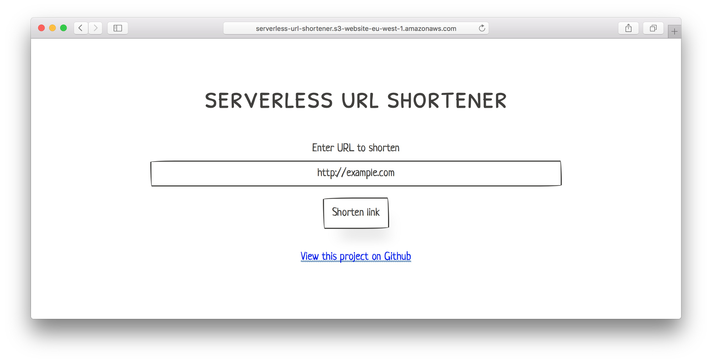
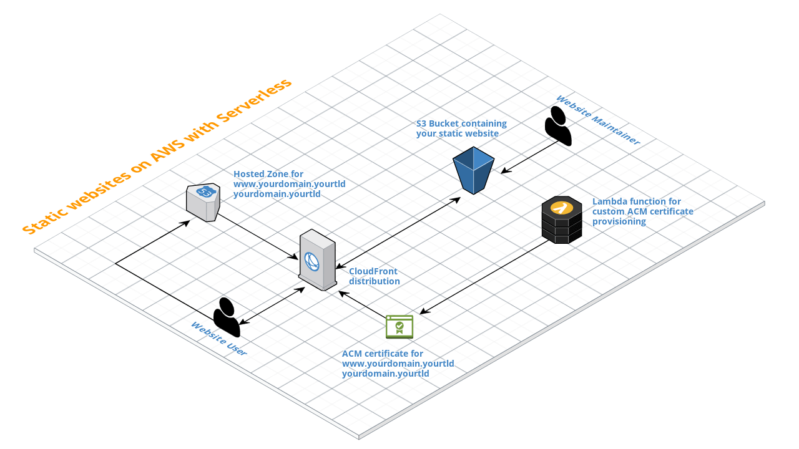

# Serverless URL Shortener

A lightweight, fully serverless URL shortener built on AWS. It uses **AWS Lambda** for the API, **Amazon S3** for redirect storage and static website hosting, **Amazon CloudFront** as a CDN, **Amazon Route 53** for DNS, and the **Serverless Framework** to orchestrate the entire infrastructure as code.

Each shortened URL is stored as an empty S3 object with the `Website-Redirect-Location` metadata key set to the target (long) URL. When a user visits the short link, S3's built-in website hosting performs a `301` redirect to the destination — no compute required for redirects. The Lambda function is only invoked when *creating* a new short link through the API.



---

## Table of Contents

- [Architecture Overview](#architecture-overview)
- [How It Works](#how-it-works)
- [Project Structure](#project-structure)
- [Prerequisites](#prerequisites)
- [Getting Started](#getting-started)
  - [1. Install Dependencies](#1-install-dependencies)
  - [2. Set Up Route 53 Hosted Zones](#2-set-up-route-53-hosted-zones)
  - [3. Provision SSL/TLS Certificates](#3-provision-ssltls-certificates)
  - [4. Configure Environment Variables](#4-configure-environment-variables)
  - [5. Deploy the Stack](#5-deploy-the-stack)
- [Usage](#usage)
  - [Shortening a URL via the Website](#shortening-a-url-via-the-website)
  - [Vanity (Custom) Short Codes](#vanity-custom-short-codes)
  - [Using the API Directly](#using-the-api-directly)
- [API Reference](#api-reference)
- [Environment Variables Reference](#environment-variables-reference)
- [Customization](#customization)
- [NPM Scripts](#npm-scripts)
- [Serverless Plugins](#serverless-plugins)
- [Libraries Used](#libraries-used)
- [Troubleshooting](#troubleshooting)
- [License](#license)

---

## Architecture Overview

The project provisions the following AWS resources via CloudFormation (defined in `serverless.yml` and the `resources/` directory):

| Resource | Purpose |
|---|---|
| **S3 Origin Bucket** | Stores redirect objects and the static website files |
| **S3 Logging Bucket** | Stores CloudFront access logs |
| **CloudFront Distribution** | CDN in front of the S3 website for HTTPS, caching, and custom domain support |
| **Route 53 Record Set** | Alias record pointing your custom short domain to the CloudFront distribution |
| **API Gateway (Edge)** | Exposes the Lambda function as a REST API with CORS enabled |
| **Lambda Function** | Handles `POST /store` requests to create new short URLs |
| **Custom Domain (API)** | Maps a friendly domain name (e.g. `api.example.com`) to the API Gateway |
| **IAM Role** | Grants the Lambda function `s3:PutObject` permission on the origin bucket |

Architecture based on [serverless-aws-static-websites](https://github.com/tobilg/serverless-aws-static-websites):



---

## How It Works

1. **User submits a long URL** through the web form (or calls the API directly).
2. **Lambda generates a short code** — either a random 7-character alphanumeric string (via [nanoid](https://github.com/ai/nanoid)) or a user-specified vanity code.
3. **Lambda checks availability** — it calls `S3.headObject` to verify the short code isn't already taken. If a vanity code is taken, a random one is generated instead.
4. **Lambda creates an S3 object** — an empty object is stored at the short code path with the `WebsiteRedirectLocation` metadata set to the long URL.
5. **User receives the short URL** — e.g. `https://example.com/abc1234`.
6. **When someone visits the short URL**, CloudFront routes the request to S3. S3 responds with a `301 Redirect` to the original long URL — no Lambda invocation is needed.

---

## Project Structure

```
serverless-url-shortener/
├── api/
│   ├── events/              # Sample event payloads for local testing
│   └── store.js             # Lambda handler — validates input, generates short code, saves to S3
├── public/
│   ├── jquery-3.2.1.min.js  # jQuery (DOM manipulation & AJAX)
│   └── paper.min.css        # PaperCSS framework stylesheet
├── resources/
│   ├── cf-distribution.yml  # CloudFront distribution (CDN)
│   ├── dns-records.yml      # Route 53 A-record alias to CloudFront
│   ├── outputs.yml          # CloudFormation stack outputs
│   ├── s3-bucket.yml        # S3 origin & logging buckets
│   └── s3-policies.yml      # S3 bucket policies (public read)
├── scripts/
│   ├── build-template.js    # Injects env vars into the HTML template → build/index.html
│   └── deploy-static.js     # Syncs static assets to S3 via the AWS CLI
├── src/
│   └── template.html        # HTML template with placeholder tokens
├── .env.example             # Example environment configuration
├── package.json             # NPM dependencies and scripts
├── serverless.yml           # Serverless Framework service definition
├── webpack.config.js        # Webpack config for bundling the Lambda function
└── README.md
```

---

## Prerequisites

Before you begin, make sure you have the following installed and configured:

| Tool | Minimum Version | Purpose |
|---|---|---|
| [Node.js](https://nodejs.org/) | 10.x+ | Runtime for Lambda and build scripts |
| [npm](https://www.npmjs.com/) or [Yarn](https://yarnpkg.com/) | npm 6+ / Yarn 1.x | Package management |
| [AWS CLI](https://aws.amazon.com/cli/) | 1.x+ | Deploying static website files to S3 |
| [Serverless Framework](https://serverless.com/) | 1.x | Infrastructure deployment and orchestration |
| AWS Account | — | With permissions for S3, Lambda, API Gateway, CloudFront, Route 53, IAM, CloudFormation |

> **Important**: Your AWS credentials must be configured locally. Follow the [Serverless Framework quick-start guide](https://serverless.com/framework/docs/providers/aws/guide/quick-start/) to set up your `~/.aws/credentials` file.

---

## Getting Started

### 1. Install Dependencies

```bash
# Clone the repository
git clone https://github.com/danielireson/serverless-url-shortener.git
cd serverless-url-shortener

# Install Node.js dependencies
npm install
```

### 2. Set Up Route 53 Hosted Zones

You need **two** Route 53 hosted zones:

1. **API Domain** (e.g. `api.example.com`) — used by the API Gateway custom domain.
2. **Short Domain** (e.g. `example.com` or `short.example.com`) — the domain that serves the website and short links.

For each:

1. Open the [Route 53 console](https://console.aws.amazon.com/route53/).
2. Create a new **Public Hosted Zone** for your domain.
3. Note the **Hosted Zone ID** — you'll need it for the environment variables.
4. Update your domain registrar's nameservers to point to the Route 53 NS records.

### 3. Provision SSL/TLS Certificates

CloudFront and API Gateway require SSL certificates issued by **AWS Certificate Manager (ACM)**.

> **Important**: CloudFront requires the certificate to be issued in **us-east-1** (N. Virginia), regardless of your deployment region.

1. Open the [ACM console](https://console.aws.amazon.com/acm/) in **us-east-1**.
2. Request a **public certificate** for your short domain (e.g. `example.com`).
3. Request another certificate (or add a SAN) for your API domain (e.g. `api.example.com`).
4. Validate the certificates via DNS (ACM can auto-create the validation records in Route 53).
5. Note the **certificate ARN** for the short domain and the **certificate name** for the API domain.

### 4. Configure Environment Variables

Create a copy of `.env.example` for each deployment stage:

```bash
# For staging
cp .env.example .env.staging

# For production
cp .env.example .env.production
```

Edit each file with your specific values. See the [Environment Variables Reference](#environment-variables-reference) section below for a detailed explanation of every variable.

**Example `.env.production`:**

```env
AWS_PROFILE=my-aws-profile
API_URL=https://api.example.com/v1/store
API_HOSTED_ZONE=Z1234567890ABC
API_CERTIFICATE_NAME=api.example.com
API_DOMAIN=api.example.com
API_BASE_ENDPOINT=v1
SHORT_URL=https://example.com
SHORT_HOSTED_ZONE=Z0987654321DEF
SHORT_DOMAIN_ACM_ARN=arn:aws:acm:us-east-1:123456789012:certificate/abcd-1234-efgh-5678
SHORT_DOMAIN=example.com
REGION=us-east-1
TITLE=My URL Shortener
CREDIT=Built with ❤️
CREDIT_URL=https://example.com
```

### 5. Deploy the Stack

Deploy everything (API + infrastructure + website) with a single command:

```bash
# Deploy to staging (default)
npm run deploy

# Deploy to production
STAGE=production npm run deploy
```

The deployment process does the following automatically (via serverless lifecycle hooks):

1. Creates the custom API Gateway domain (`sls create_domain`).
2. Deploys the Lambda function and API Gateway via CloudFormation.
3. Builds the website template (`yarn build`), injecting environment variables.
4. Deploys the static website files to S3 (`sls client deploy`).
5. Invalidates the CloudFront cache (`sls cloudfrontInvalidate`).

---

## Usage

### Shortening a URL via the Website

1. Open your short domain in a browser (e.g. `https://example.com`).
2. Paste the long URL into the input field.
3. Click **"Shorten link"**.
4. The shortened URL will appear below the form — copy and share it.

### Vanity (Custom) Short Codes

You can specify a custom shortcode instead of a randomly generated one by adding a `?vanity=` query parameter to the homepage URL:

```
https://example.com?vanity=my-custom-code
```

When you submit a URL through this page, the shortener will attempt to use `my-custom-code` as the path. If the vanity code is already taken, a random code will be used as a fallback.

**Rules for vanity codes:**
- Must match the pattern `[0-9a-zA-Z-_]+` (alphanumeric, hyphens, and underscores).
- Cannot contain spaces or special characters.

### Using the API Directly

You can also create short links programmatically by calling the API:

```bash
curl -X POST https://api.example.com/v1/store \
  -H "Content-Type: application/json" \
  -d '{"url": "https://www.example.com/very/long/url/that/needs/shortening"}'
```

With a vanity code:

```bash
curl -X POST https://api.example.com/v1/store \
  -H "Content-Type: application/json" \
  -d '{"url": "https://www.example.com/long-url", "vanity": "my-code"}'
```

---

## API Reference

### `POST /store`

Creates a new shortened URL.

**Request Body** (JSON):

| Field | Type | Required | Description |
|---|---|---|---|
| `url` | `string` | Yes | The full URL to shorten (must include protocol, e.g. `https://`) |
| `vanity` | `string` | No | A custom short code. Must match `[0-9a-zA-Z-_]+` |

**Success Response** (`200`):

```json
{
  "message": "URL successfully shortened",
  "path": "abc1234",
  "url": "https://example.com/abc1234"
}
```

**Error Responses:**

| Status | Message | Cause |
|---|---|---|
| `400` | `URL is required` | Request body missing the `url` field |
| `400` | `URL is invalid` | The provided URL is malformed (missing protocol or host) |

---

## Environment Variables Reference

| Variable | Required | Description |
|---|---|---|
| `BUCKET` | Yes | Name prefix for the S3 bucket that stores URL redirects. The actual bucket name becomes `serverless-url-shortener-{stage}-origin`. |
| `REGION` | Yes | AWS region for deployment (e.g. `us-east-1`). CloudFront certificates must be in `us-east-1`. |
| `API_URL` | Yes | Full URL of the API endpoint the website form submits to (e.g. `https://api.example.com/v1/store`). |
| `API_DOMAIN` | Yes | Custom domain name for the API Gateway (e.g. `api.example.com`). |
| `API_HOSTED_ZONE` | Yes | Route 53 hosted zone ID containing the API domain. |
| `API_CERTIFICATE_NAME` | Yes | ACM certificate name (usually the domain name) for the API custom domain. |
| `API_BASE_ENDPOINT` | Yes | Base path mapping for the API Gateway (e.g. `v1`). This becomes the URL prefix. |
| `SHORT_URL` | Yes | Base URL for generated short links, **without** a trailing slash (e.g. `https://example.com`). |
| `SHORT_DOMAIN` | Yes | Custom domain for the CloudFront distribution serving the website (e.g. `example.com`). |
| `SHORT_HOSTED_ZONE` | Yes | Route 53 hosted zone ID containing the short domain. |
| `SHORT_DOMAIN_ACM_ARN` | Yes | Full ARN of the ACM certificate for the short domain. Must be in `us-east-1`. |
| `TITLE` | No | Custom title displayed on the website and in the browser tab. Defaults to `serverless url shortener`. |
| `CREDIT` | No | Custom text for the footer credit link. Defaults to `View this project on Github`. |
| `CREDIT_URL` | No | URL that the footer credit link points to. Defaults to the GitHub repository. |
| `AWS_PROFILE` | No | Named AWS CLI profile from `~/.aws/credentials`. Useful if you have multiple AWS accounts. |

---

## Customization

### Website Appearance

The website uses the [PaperCSS](https://github.com/papercss/papercss) framework for styling. To customize the look and feel:

- **Title & Branding**: Set the `TITLE` environment variable.
- **Footer Credit**: Set `CREDIT` and `CREDIT_URL` environment variables.
- **CSS**: Modify `public/paper.min.css` or add a custom stylesheet to the `public/` directory and reference it in `src/template.html`.
- **HTML Structure**: Edit `src/template.html` directly. Placeholder tokens (`INSERT_TITLE`, `INSERT_API_URL`, `INSERT_CREDIT`, `INSERT_CREDIT_URL`) are replaced at build time by `scripts/build-template.js`.

### Short Code Length & Character Set

The default short code is **7 characters** long, drawn from a URL-safe alphanumeric character set (excluding `-` and `_`). To change this:

- **Length**: Edit the `7` in the `nanoid(CHARACTERS, 7)` call in `api/store.js`.
- **Characters**: Modify the `CHARACTERS` constant in `api/store.js`.

### Multiple Stages

The project supports deploying to multiple stages (e.g. staging, production). Each stage gets its own:

- S3 buckets (named `serverless-url-shortener-{stage}-origin` and `-logs`)
- CloudFront distribution
- API Gateway deployment
- Custom domain mapping

---

## NPM Scripts

| Script | Command | Description |
|---|---|---|
| `build` | `npm run build` | Cleans the `build/` directory, copies `public/` assets, and injects environment variables into the HTML template. |
| `deploy` | `npm run deploy` | Deploys the full Serverless stack (Lambda, API Gateway, S3, CloudFront, Route 53) to AWS. Defaults to the `staging` stage. Prefix with `STAGE=production` for production. |
| `deploy:client` | `npm run deploy:client` | Deploys only the static website files to S3 and invalidates the CloudFront cache. |

---

## Serverless Plugins

| Plugin | Purpose |
|---|---|
| [serverless-webpack](https://github.com/serverless-heaven/serverless-webpack) | Bundles the Lambda function with Webpack and Babel for ES6+ support. |
| [serverless-finch](https://github.com/fernando-mc/serverless-finch) | Deploys static website files from `build/` to the S3 origin bucket. |
| [serverless-cloudfront-invalidate](https://github.com/endemics/serverless-cloudfront-invalidate) | Invalidates the CloudFront cache after website deployments. |
| [serverless-plugin-reducer](https://github.com/medikoo/serverless-plugin-reducer) | Reduces the Lambda deployment package size by removing unnecessary files. |
| [serverless-domain-manager](https://github.com/amplify-education/serverless-domain-manager) | Manages custom domains for the API Gateway. |
| [serverless-scriptable-plugin](https://github.com/wei-mao/serverless-scriptable-plugin) | Runs custom shell commands at various lifecycle hooks during deployment. |

---

## Libraries Used

| Library | Purpose |
|---|---|
| [Serverless Framework](https://serverless.com) | Infrastructure-as-code, deployment orchestration, and project structure. |
| [PaperCSS](https://github.com/papercss/papercss) | Lightweight CSS framework for the frontend with a hand-drawn, informal aesthetic. |
| [jQuery 3.2.1](https://jquery.com) | DOM manipulation and AJAX requests for the frontend form. |
| [nanoid](https://github.com/ai/nanoid) | Generates compact, URL-friendly, random unique IDs for short codes. |
| [nanoid-good](https://github.com/y-gagar1n/nanoid-good) | Wraps nanoid with a profanity filter to avoid generating offensive short codes. |
| [AWS SDK](https://aws.amazon.com/sdk-for-javascript/) | Interacts with AWS S3 from within the Lambda function. |

---

## Troubleshooting

### Common Issues

**`BUCKET` variable not set / S3 access denied**
- Make sure your `.env.{stage}` file exists and contains all required variables.
- Verify your AWS credentials have `s3:PutObject` permission on the target bucket.

**CloudFront returns 403 Forbidden**
- The S3 bucket policy may not be set up correctly. Check `resources/s3-policies.yml`.
- Ensure the bucket has `PublicRead` access control enabled.

**Custom domain not resolving**
- Verify the Route 53 hosted zone IDs are correct in your environment file.
- Ensure DNS propagation has completed (can take up to 48 hours for new domains).
- Check that the ACM certificate is **validated** (not pending).

**API Gateway returns 500 Internal Server Error**
- Check CloudWatch Logs for the Lambda function in your deployment region.
- Ensure the `BUCKET` and `REGION` environment variables are correctly set in `serverless.yml`.

**Website shows `INSERT_TITLE` or similar placeholders**
- The build step may have failed. Run `npm run build` manually and check for errors.
- Ensure the `API_URL` environment variable is set before building.

### Useful Commands

```bash
# View Lambda logs
sls logs -f store -s staging --tail

# Invoke the function locally
sls invoke local -f store -p api/events/store.json -s staging

# Remove the entire stack
STAGE=staging npm run deploy -- --remove
```

---


